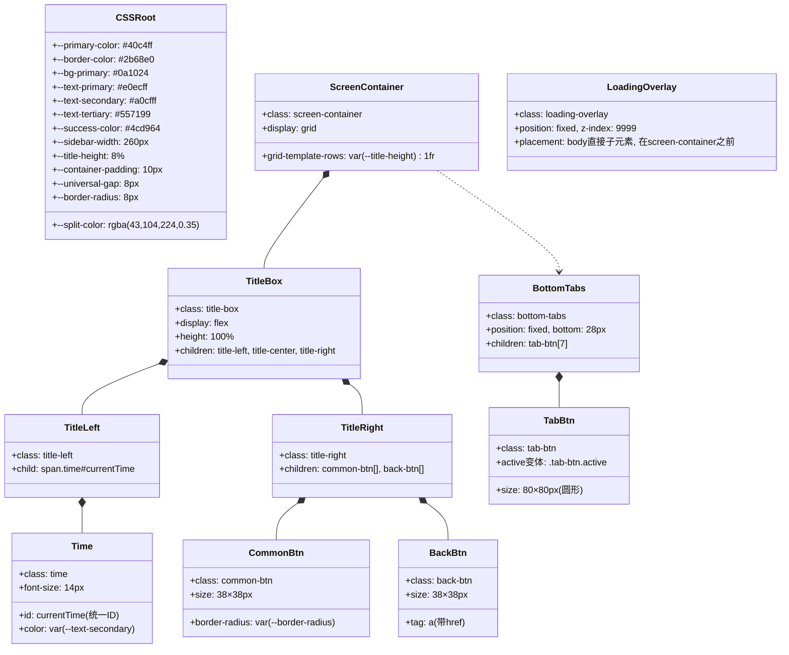
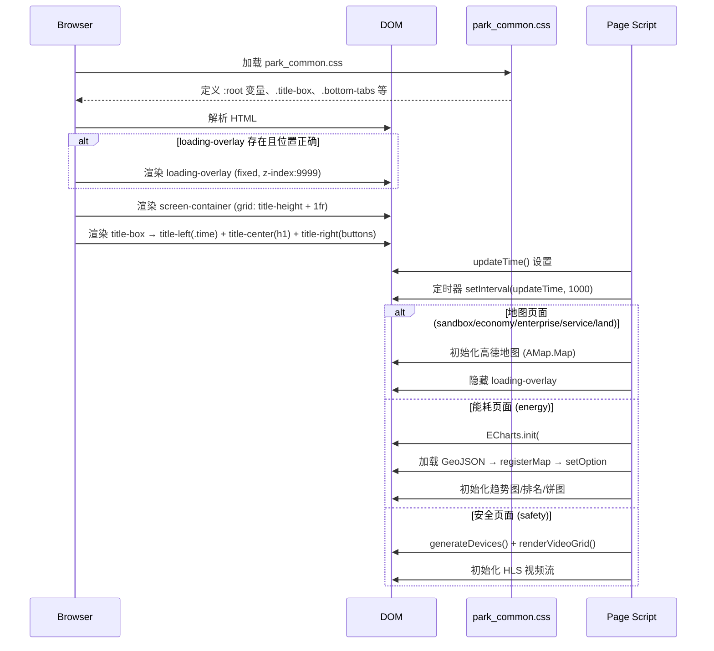
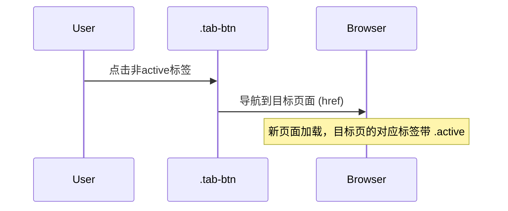
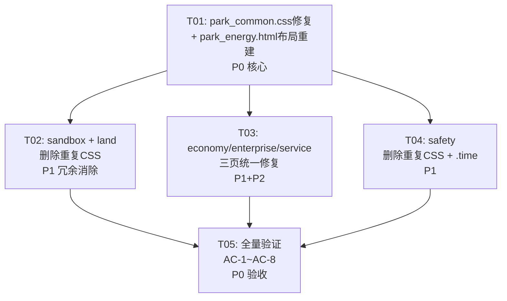

# 系统设计文档：7个园区子页面标题栏统一方案

## Part A: 系统设计

### 1. 实施方案分析

#### 核心挑战

| # | 挑战 | 严重度 |
|---|------|--------|
| 1 | park_energy.html 使用完全不同的布局模型（absolute定位 vs grid布局），`.title-bar` 而非 `.title-box` | P0 |
| 2 | `.time` 选择器仅嵌套在 `.title-box .time` 下，缺少独立选择器 | P0 |
| 3 | 7个页面各自复制了约75行 `.bottom-tabs` CSS，合计约500+行冗余 | P1 |
| 4 | sandbox/land/economy/enterprise/service 5个页面复制了 `.map-wrapper` / `#amap` / `.control-bar` / `.ctrl-btn` | P1 |
| 5 | economy/enterprise/service 三页的 `loading-overlay` 放在 `screen-container` 内部（DOM结构错误） | P2 |
| 6 | 三个不同的 time ID（`currentTime`/`headerTime`/`energyTime`） | P2 |

#### 技术方案

**a) park_common.css 作为唯一CSS事实源**

park_common.css 已经定义了几乎所有共享样式（`.title-box`, `.common-btn`, `.back-btn`, `.map-wrapper`, `#amap`, `.control-bar`, `.ctrl-btn`, `.bottom-tabs`, `.tab-btn`, `.loading-overlay`, 动画等）。我们仅需：

1. **补充缺失的CSS变量**（虽然当前 `:root` 已包含所有变量，但需确认实际值是否匹配各页面期望）
2. **添加独立 `.time` 选择器**，使其在 title-box 内外均可用
3. 各页面删除重复定义

**b) park_energy.html 布局改造策略**

当前 energy 使用 `position: absolute` 全屏布局：
```css
.eng-map { position: absolute; top: 64px; left: 0; width: 100%; height: calc(100% - 64px); }
.title-bar { position: absolute; top: 0; left: 0; right: 0; height: 64px; }
```

改为标准 `screen-container` grid 布局：
```css
/* 删除 .title-bar，改用 park_common.css 的 .title-box */
/* .eng-map 改为 grid 第二行，position: relative; width: 100%; height: 100% */
```

选择此方案的理由：
- grid 布局使标题栏高度由 `--title-height: 8%` 统一控制
- ECharts 的 `echarts.init(dom)` 会自适应容器大小
- 浮动面板（`.panel-top-center`, `.map-overlay-panel`）保持 absolute 定位在 `.map-wrapper` 内部即可

---

### 2. 文件列表

| 文件 | 动作 | 说明 |
|------|------|------|
| `pages/park_common.css` | **修改** | 添加独立 `.time` 选择器，确认CSS变量完整性 |
| `pages/park_energy.html` | **重大修改** | title-bar→title-box，absolute→grid布局，删除重复CSS |
| `pages/park_sandbox.html` | **修改** | 删除重复CSS（~113行） |
| `pages/park_land.html` | **修改** | 删除重复CSS（~117行） |
| `pages/park_economy.html` | **修改** | 删除重复CSS（~108行），修复loading-overlay位置，time ID统一 |
| `pages/park_enterprise.html` | **修改** | 删除重复CSS（~108行），修复loading-overlay位置，time ID统一 |
| `pages/park_service.html` | **修改** | 删除重复CSS（~108行），修复loading-overlay位置，time ID统一 |
| `pages/park_safety.html` | **修改** | 删除重复CSS（~76行），删除独立 `.time` 选择器 |

---

### 3. 数据结构与接口

本方案为纯 CSS + HTML 重构，无新增数据结构。以下是关键类/ID 契约：



---

### 4. 程序调用流

#### 4.1 页面加载流程（所有7个页面统一）



#### 4.2 底部按钮切换流程



---

### 5. 不确定项与假设

| # | 问题 | 决定 | 理由 |
|---|------|------|------|
| 1 | energy 是否改为 grid 布局？ | **是** | 统一使用 `screen-container` grid，标题栏高度由 `--title-height` 控制；ECharts 自适应容器大小 |
| 2 | time ID 是否统一为 `currentTime`？ | **是** | 简化 JS，所有页面使用同一 ID |
| 3 | loading-overlay 位置是否修复？ | **是（P2级）** | economy/enterprise/service 三页移到 `screen-container` 之前 |
| 4 | land 页的 map-wrapper 使用 `border-radius: 8px` 而非 `var(--border-radius)` | **保持现有** | `var(--border-radius)` 也是 `8px`，删除重复后由 common.css 提供 |
| 5 | CSS 变量值确认 | 已确认 | park_common.css 的 `:root` 已包含所有必要变量（--text-primary: #e0ecff 等），但 safety 页面使用的 `--text-primary` 值与 common.css 的 `#fff` 不同 |

---

## Part B: 任务分解

### 6. 所需第三方包

本方案为纯 HTML+CSS+JS 重构，无新增依赖。

```
- (无新增) — 仅修改现有文件
```

### 7. 任务列表（按依赖排序）

#### T01: park_common.css 基础修复 + park_energy.html 布局重建（P0核心）

**描述**: 修复 park_common.css 的 `.time` 选择器问题；将 park_energy.html 从 absolute 定位改为标准 grid 布局，统一标题栏结构。

**源文件**:
- `pages/park_common.css` — 添加独立 `.time` 选择器
- `pages/park_energy.html` — 布局重建：title-bar→title-box，eng-map absolute→grid，删除重复CSS，统一time ID

**修改详情**:

**park_common.css**（在第51行 `.title-box .time` 之后添加）:
```css
/* 独立 .time 选择器（供非 title-box 场景使用） */
.time {
    font-size: 14px;
    color: var(--text-secondary);
}
```

**park_energy.html** 修改:
1. 删除 `<style>` 中的 `.title-bar` 全部定义（第28-47行，20行）
2. 删除 `<style>` 中的 `.bottom-tabs`/`.tab-btn` 全部定义（第112-173行，62行）
3. 将 `.eng-map` 的 CSS 从 `position: absolute; top: 64px; ...` 改为：
   ```css
   .eng-map {
       width: 100%; height: 100%;
   }
   ```
4. 将 HTML 中的 `<div class="title-bar">` 块（第177-184行）替换为标准结构：
   ```html
   <div class="screen-container">
       <div class="title-box">
           <div class="title-left">
               <span class="time" id="currentTime"></span>
           </div>
           <div class="title-center">
               <h1>用能监测</h1>
           </div>
           <div class="title-right">
               <button class="common-btn" onclick="location.reload()" title="刷新">
                   <i class="fa fa-refresh"></i>
               </button>
               <a href="../index.html" class="back-btn" title="返回主页">
                   <i class="fa fa-home"></i>
               </a>
           </div>
       </div>
       <div class="map-wrapper">
           <div class="eng-map" id="engMap"></div>
           <!-- 保留所有浮动面板在 map-wrapper 内 -->
       </div>
   </div>
   ```
5. 将 JS 中 `document.getElementById("energyTime")` 改为 `document.getElementById("currentTime")`
6. 将 `.panel-top-center` 从 `top:72px` 改为 `top:10px`（因为现在在 map-wrapper 内部相对定位）

**依赖**: 无

**优先级**: P0

---

#### T02: park_sandbox.html + park_land.html 删除重复CSS（P1冗余消除-地图类）

**描述**: 删除 sandbox 和 land 页面中已在 park_common.css 定义的重复CSS规则（map-wrapper, amap, control-bar, ctrl-btn, keyframes, bottom-tabs）。

**源文件**:
- `pages/park_sandbox.html` — 删除重复CSS
- `pages/park_land.html` — 删除重复CSS

**修改详情**:

**park_sandbox.html**:
- 删除第27-77行：`.map-wrapper`, `#amap`, `.control-bar`, `.ctrl-btn`, `@keyframes blinkMarker`, `@keyframes blinkBorder`（51行）
- 删除第80-141行：`.bottom-tabs`, `.tab-btn` 及所有相关样式+`@keyframes tabRotate`, `@keyframes tabPulse`（62行）
- 删除第11-25行的空注释行（`/* ===== 大屏布局容器 ===== */` 等，4行）

**park_land.html**:
- 删除第19-35行：`.map-wrapper`, `#amap`（17行）
- 删除第105-141行：`.control-bar`, `.ctrl-btn`（37行）
- 删除第213-275行：`.bottom-tabs`, `.tab-btn` 及所有相关样式（63行，含 `<style>` 标签）

**依赖**: T01（确保 park_common.css 已完整）

**优先级**: P1

---

#### T03: park_economy/enterprise/service 三页统一修复（P1冗余消除+ P2 DOM修复）

**描述**: 删除三页所有重复CSS；统一 time ID 为 `currentTime`；修复 loading-overlay 从 screen-container 内部移到外部。

**源文件**:
- `pages/park_economy.html` — 删除重复CSS + 修复loading-overlay + 统一time ID
- `pages/park_enterprise.html` — 同上
- `pages/park_service.html` — 同上

**修改详情**:

每个文件执行相同操作：
1. 删除第19-63行：`.map-wrapper`, `#amap`, `.control-bar`, `.ctrl-btn`, `@keyframes blinkMarker`, `#loadingOverlay.hide`（45行）
2. 删除第65-126行：`.bottom-tabs`, `.tab-btn` 及所有相关（62行）
3. 将第1156行 `id="headerTime"` → `id="currentTime"`
4. 将 JS 中所有 `getElementById("headerTime")` → `getElementById("currentTime")`
5. 将第1170-1174行的 loading-overlay 块移动到 `<div class="screen-container">` 之前（即第1153行之前）

**依赖**: T01（确保 park_common.css 已完整）

**优先级**: P1（删除CSS冗余）+ P2（loading-overlay修复）

---

#### T04: park_safety.html 冗余删除 + `.time` 选择器验证

**描述**: 删除 safety 页面的重复 bottom-tabs CSS 和独立 `.time` 选择器（已由 park_common.css 提供）。

**源文件**:
- `pages/park_safety.html` — 删除重复CSS

**修改详情**:
1. 删除第184-244行：`.bottom-tabs`, `.tab-btn` 及所有相关（61行，含 `<style>` 标签）
2. 删除第21行：`.time { font-size: 14px; color: var(--text-secondary); }`（已由 park_common.css 提供）
3. 确认 JS 中 `getElementById("currentTime")` 已正确

**依赖**: T01

**优先级**: P1

---

#### T05: 全量验证与调优（AC-1~AC-8 验收）

**描述**: 逐页打开验证，检查标题栏一致性、按钮大小、底部标签动画、功能正常性。修复任何视觉/功能回归。

**源文件**:
- 以上所有文件（验证性回顾）

**验证清单**:
| AC | 验证方法 |
|----|---------|
| AC-1 | 7个页面标题栏高度/背景/边框/阴影一致 → DevTools截图对比 |
| AC-2 | 所有 common-btn 38×38px → DevTools computed |
| AC-3 | 所有 back-btn 38×38px → DevTools computed |
| AC-4 | 底部7个圆形标签位置/大小/动画一致 → 截图对比 |
| AC-5 | park_*.html 不含 .title-box/.bottom-tabs/.tab-btn/.common-btn 重复定义 → grep 搜索 |
| AC-6 | energy 页面与其他页面视觉一致 → 对比截图 |
| AC-7 | 刷新/跳转/时间显示功能正常 → 手动测试 |
| AC-8 | 底部标签顺序一致 → 目视检查 |

**依赖**: T02, T03, T04

**优先级**: P0

---

### 8. 共享知识

```
- 所有页面引用 <link rel="stylesheet" href="park_common.css"> 作为唯一CSS来源
- park_common.css 定义全部 :root 变量、.title-box、.common-btn、.back-btn、.ctrl-btn、.tab-btn、.bottom-tabs、.map-wrapper、#amap、.control-bar、.loading-overlay 及所有动画
- 时间统一使用 <span class="time" id="currentTime"></span>
- JS 中统一使用 document.getElementById("currentTime")
- 底部标签数组顺序: 沙盘→经济→用地→企业→服务→能耗→安全
- 当前页面标签添加 class="tab-btn active" 和 style="pointer-events:none;opacity:0.8"
- 加载动画 .loading-overlay 必须是 <body> 的直接子元素，位于 .screen-container 之前
- 页码布局: .screen-container 使用 grid-template-rows: var(--title-height) 1fr
- 75行底部标签CSS = 约62行实际CSS + 13行格式/注释
```

---

### 9. 任务依赖图



**总预计删除行数**:

| 文件 | 删除行数 |
|------|---------|
| park_sandbox.html | ~117行 |
| park_land.html | ~117行 |
| park_economy.html | ~108行 |
| park_enterprise.html | ~108行 |
| park_service.html | ~108行 |
| park_energy.html | ~82行 |
| park_safety.html | ~62行 |
| **合计** | **~702行** |

---

### 10. 风险点

| 风险 | 缓解措施 |
|------|---------|
| energy 页面改为 grid 后 ECharts 地图尺寸异常 | ECharts 的 `echarts.init(dom)` 测量容器尺寸，grid 第二行会自动填充；配合 `window.resize` 事件重绘 |
| 删除重复CSS后某些页面出现样式缺失 | park_common.css 已逐行对比确认包含所有删除规则的完整定义 |
| economy/enterprise/service 三页 JS 频繁使用 `headerTime` 引用 | 需搜索替换所有 `"headerTime"` 字符串为 `"currentTime"` |
| 浮动面板绝对定位基准变化 | energy 改 grid 后 `.map-wrapper` 容器成为新的定位基准（position: relative），面板 absolute 定位在 map-wrapper 内即可 |
